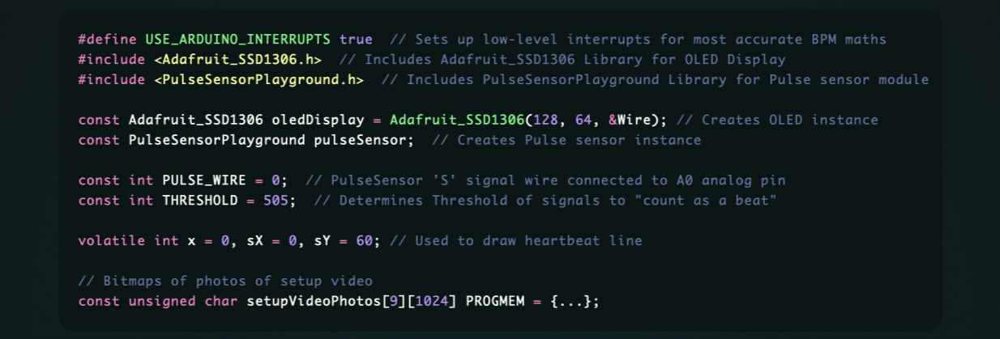
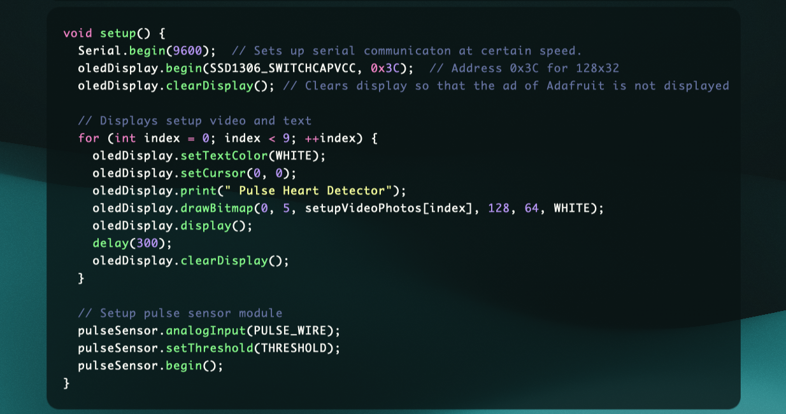

# Heart Pulse Detector Project (BPM Counter)   :heart:

In this project, we will create BPM (Beats Per Minute) Calculator & Counter using Heart Pulse Sensor, 0.96 OLED Display with 128x64 resolution & Arduino UNO Board.

## Components that we need

- [x] Arduino UNO Board:

[Arduino](https://www.arduino.cc) is an open-source electronics platform based on easy-to-use hardware and software that designs and manufactures single-board microcontrollers and microcontroller kits for building digital devices. Arduino boards are able to read inputs for example from light on a sensor, a finger on a button, or an Email. Then you can tell your board what to do by sending a set of instructions to the microcontroller on the board. Then the desired output is produced, for example, it can display something through monitors, activating a motor, turning on an LED or even publishing something online.

- [x] Heart Pulse Sensor:

An alternate name of this sensor is heartbeat sensor or heart rate sensor. It's a plug & play sensor mainly designed for Arduino board. This sensor uses an easy optical pulse sensor along with amplification & cancellation of noise to make a circuit. By using this circuit, we can get fast and reliable heartbeat readings. This circuit can be operated with 4mA current and 5V voltage to use in mobile applications.

- [x] 0.96 OLED Display:

2.44 cm (0.96 inch) OLED (Organic Light-Emitting Diode) Display Module is a precise small, White OLED module which can be interfaced with any microcontroller using SPI protocol. It's having a resolution of 128x64. The package includes display board, display, 4 pin male header pre-soldered to board. This type of display has a self light-emitting technology composed of a thin, multi-layered organic film placed between an anode and cathode. In contrast to LCD technology, OLED does not require a backlight.

## The internal structure of Heart Pulse Sensor
This sensor is created mainly using two components. That is, the ADPS-9008 light photosensor and the one green LED. Next, on the backside of this sensor, we can see additional components with the LED. Among these, we can see resistors, capacitors, op-amp, and one reverse protection diode.

## How heart pulse sensor works?
When your finger is close to the sensor, the green light on the sensor falls on your fingertip, and the light is reflected also towards the sensor. Then, this green light is absorbed into the hemoglobin of the blood. Also, as the amount of blood in our body is constantly pumping, the amount of hemoglobin in the blood also increases or decreases. Therefore, the amount of reflected light also increases or decreases. This difference is captured by the photosensor. (This is known as optical heart rate sensory theory) Finally, we can get this signal as an analog value.

## Pulse Sensor & OLED Display Connections:

| PULSE SENSOR PIN | ARDUINO PIN |
| ---------------- | ----------- |
| VCC              | 5V          |
| GND              | GND         |
| SIGNAL PIN       | A0          |

| OLED DISPLAY | ARDUINO PIN |
| ------------ | ----------- |
| VCC          | 5V          |
| GND          | GND         |
| SDA          | A4          |
| SCL          | A5          |

## Programing Board with Arduino IDE

For Programming your Board you need [Arduino IDE](https://www.arduino.cc/en/software) software.

## Playing setup video

We want a video to be displayed when the board is launched. In general, Arduino doesn't allow photo and video playback in the usual way. First, We need to convert the photos to Arduino format using [image to cpp website](https://diyusthad.com/image2cpp) (This website create bitmap of photos). Then we can convert the photos into video by playing them fast and without delay.

## Structure of Arduino projects codes

We can divide the program codes into three parts:
1. Definition of libraries, variables, constants and bitmaps.

2. Setup function that works only once when the board is connected to the voltage source.

3. Loop function that is repeated like a loop until the board is connected to the voltage source.

## Uploading Project on Board

* Open [PulseDetectorProject.ino](PulseDetectorProject/PulseDetectorProject.ino) file and Compile it using Arduino IDE (Hit verify button).
* Connect Arduino board to device.
* Select board on IDE.
* Hit upload button.

Congratulation. Now you have a Heart Pulse Detector (BPM Counter).  :partying_face:

Hope You Enjoy...

## Contributors

Feel free to share your ideas or any other problems. Pull requests are welcomed.

## Author

- [Mehdi Karami](https://www.github.com/mehdi2003karami)

## License

`Heart Pulse Detector Using Arduino` is released under an MIT license. See [LICENSE](https://github.com/mehdi2003karami/SwiftArrayPermutations/LICENSE) for more information.
